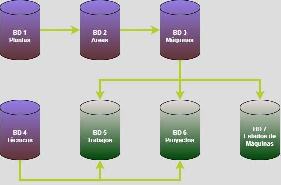

# mantt_register
Desarrollo de plataformas en Google AppSheet para registro de trabajos de mantenimiento y paradas de máquinas

En muchas plantas, se requiere registrar de forma efectiva y rápida el mantenimiento para tener registros históricos que posteriormente se puedan analizar. A veces, la información se registra con notas sueltas, por lo que una aplicación fácil de usar e intuitiva y que funcione como un formulario nos puede ayudar. Para eso, se puede usar Google AppSheet, en este caso, apoyado con Hojas de Cálculo de Google.
En este caso, se desarrollaron dos plataformas, una para registrar trabajos de mantenimiento y otras para registrar estados de máquinas.

Con ello. nos permite:
* Rápido almacenamiento de la aplicación
* Almacenamiento de la información en una nube para análisis posterior
* Posibilida de registro in situ desde el celular
* Uso intruitivo de la aplicación

 Se usan 7 bases de datos principales:
 * Plantas
 * Áreas
 * Máquinas
 * Técnicos
 * Trabajos
 * Proyectos
 * Estados de Máquinas

Los videos demostrativos del desarrollo del proyecto los puede encontrar en este enlace:
https://drive.google.com/drive/folders/12fnMDtDSJEf9iLbD_NOYo-uvs_kojvAE?usp=sharing
